# ESP32-C3 (ESP8266) Aquarium Climate Controller

A smart aquarium thermostat based on ESP32-C3. Features air temperature/humidity monitoring, heater control with a night operation mode, a custom web control portal, and seamless integration with Home Assistant.

<h1 align="center">English version below</h1>

# Розумний термостат для акваріума на базі ESP32-C3 (ESP8266) з підтримкою моніторингу температури повітря і вологості в кімнаті та керуванням нагрівачем акваріуму, враховує нічний тариф.

## 🚀 Можливості
* **Точний термостат:** Режим "bang-bang" з налаштовуваним гістерезисом.
* **Аварійний захист:** Автоматичне ввімкнення при падінні температури нижче критичного рівня.
* **Нічний режим:** Економія енергії та дотримання графіку нагріву.
* **Моніторинг клімату:** Вимірювання температури та вологості повітря (AHT10).
* **Апаратна надійність:** Схема керування реле через транзистор C945 (захист від невідповідності логічних рівнів).

# Увага!
Запам'ятовується не стан з карточки термостата, а параметр
    name: "Aquarium Target Temp"
    id: aqua_target_temp
## 🧠 Логіка роботи термостата

Система працює за ієрархічним принципом, де автоматизація керує головним вимикачем **`Thermostat Master Switch`**, а не безпосередньо реле. Це дозволяє зберігати контроль над станом термостата.

### 1. Аварійний режим (Emergency) - Пріоритет #1
Якщо температура води падає нижче `Target Temp` - `Emergency Delta`, система примусово вмикає **`Thermostat Master Switch`**. Це активує кліматичний компонент `aqua_climate`, який, своєю чергою, вмикає нагрівач через реле.

### 2. Нічний режим (Night Schedule) - Пріоритет #2
Цей режим керується перемикачем **"Enable Night Schedule"** (`schedule_mode`).

* **Якщо режим УВІМКНЕНО:**
  * Система перевіряє поточний час (синхронізація через SNTP).
  * **Денний період (06:50 – 23:10):** Система вимикає `Thermostat Master Switch`.
  * **Нічний період (23:10 – 06:50):** Система вмикає `Thermostat Master Switch`.
* **Якщо режим ВИМКНЕНО:**
  * Автоматика не втручається, термостат працює згідно з ручними налаштуваннями `Target Temp`.

### 3. Робота в режимі Offline (Fail-safe)
Якщо Wi-Fi відсутній або синхронізація часу не вдалася, система не може гарантувати коректність розкладу. У цьому випадку спрацьовує механізм безпеки:
* Система примусово вмикає **`Thermostat Master Switch`**, щоб забезпечити нагрів води та запобігти переохолодженню акваріума.

### 4. Діаграма логіки
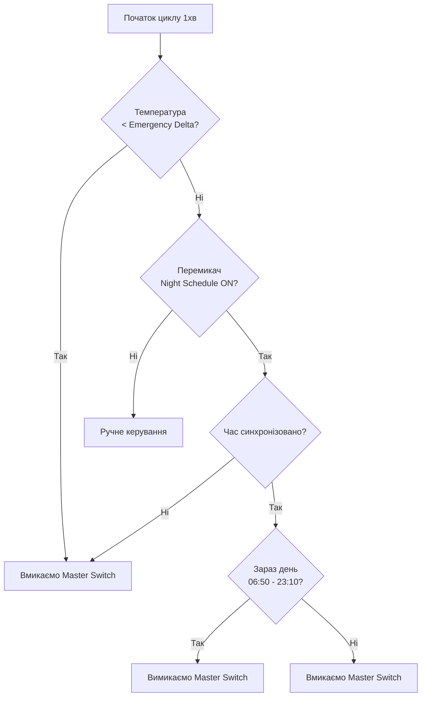
Графіки роботи і інтерфейс в НА:
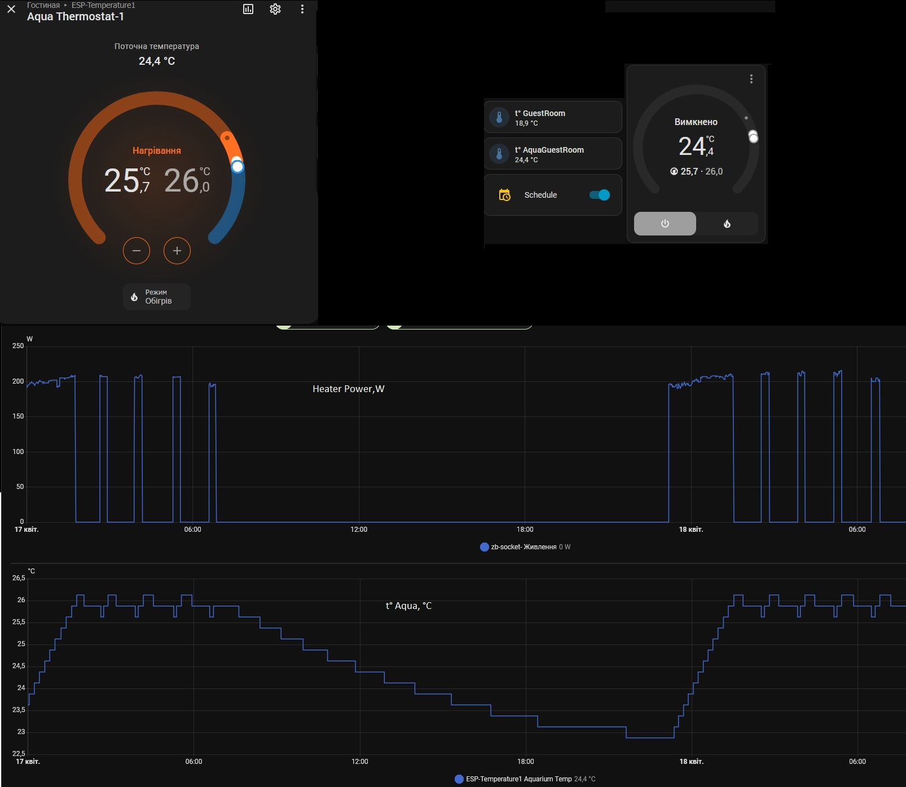

## 🛠 Компоненти
* **Контролер:** ESP32-C3 Mini.
* **Температура води:** DS18B20 (OneWire).
* **Клімат кімнати:** AHT10 (I2C).
* **Силова частина:** Реле на 5V + транзистор C945 (NPN).

## 🔌 Схема підключення

### Таблиця пінів (Pinout)
| Компонент         | Пін ESP32-C3 | Примітка 
| :---              | :---         | :---     
| DS18B20           | GPIO4        | Потрібен резистор 4.7k 
| AHT10 (SDA)       | GPIO6        | I2C 
| AHT10 (SCL)       | GPIO7        | I2C 
| Реле (через C945) | GPIO5        | Вихід керування 
| Status LED        | GPIO10       | PWM 

### Схема драйвера реле (C945)
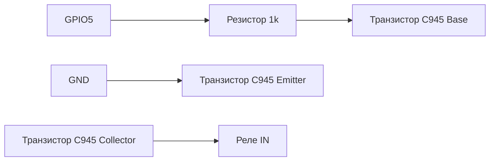
Схема:
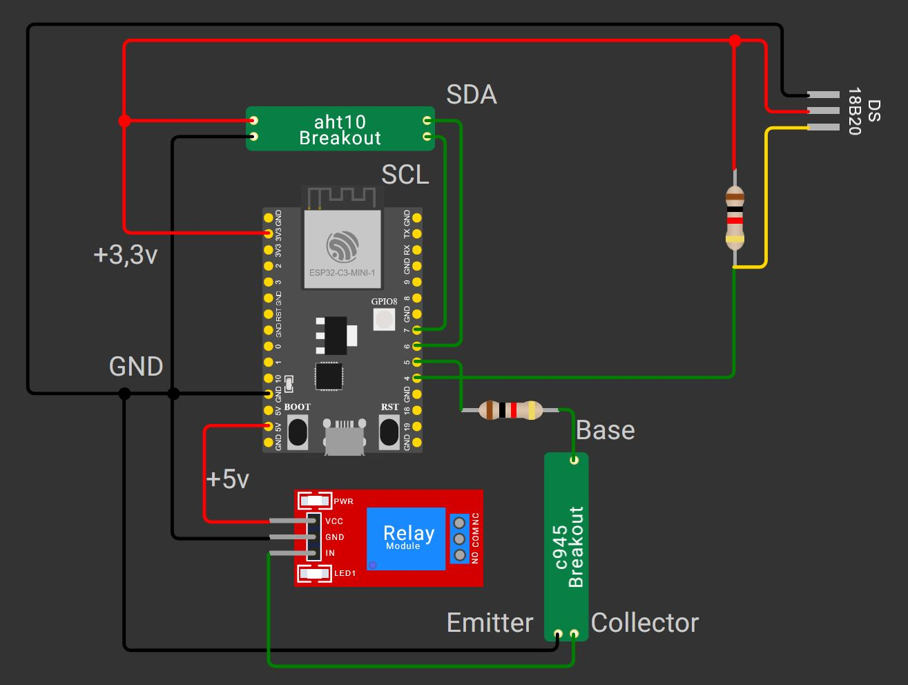

> ### ⚠️ Увага
> **Безпека:** Цей пристрій керує нагрівачем, що працює з напругою 220V. 
> Дотримуйся правил техніки безпеки при монтажі силової частини.

WEB інтевфейс:
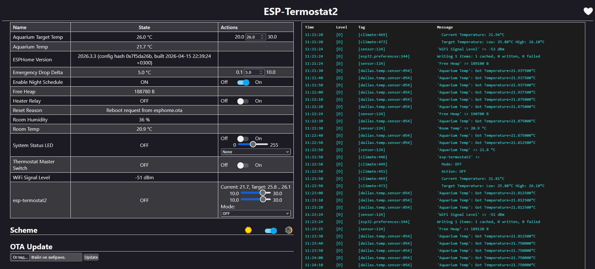

HOME ASSISTANT інтевфейс:
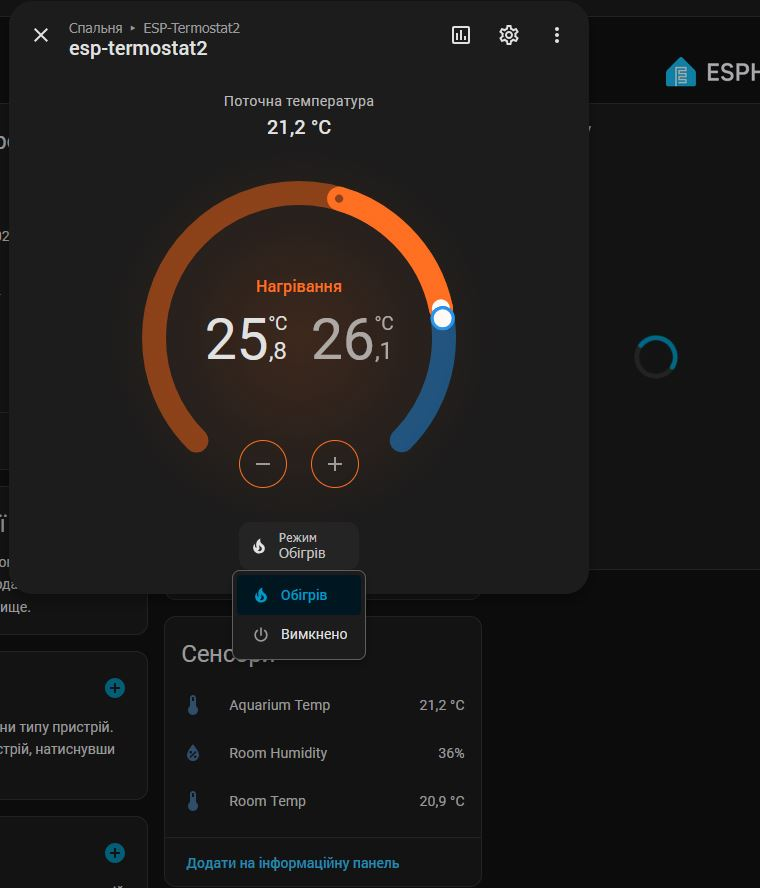
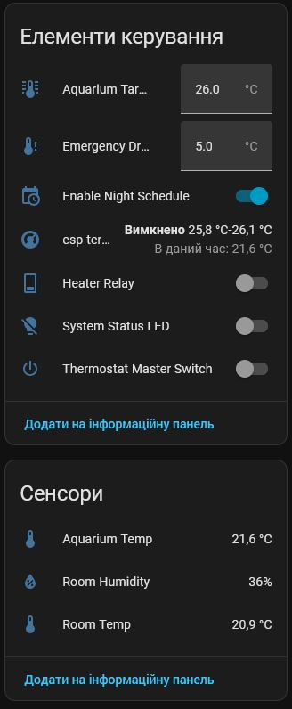
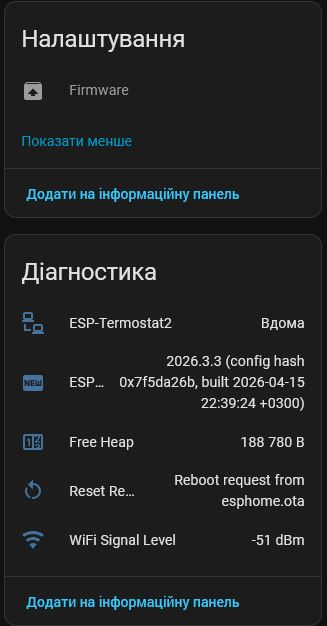

⚙️ Деталі/модулі:

Development Board Modules Super Mini Development Board 32-Bit Single-Core Processor ESP32 C3 16Pin Type-C

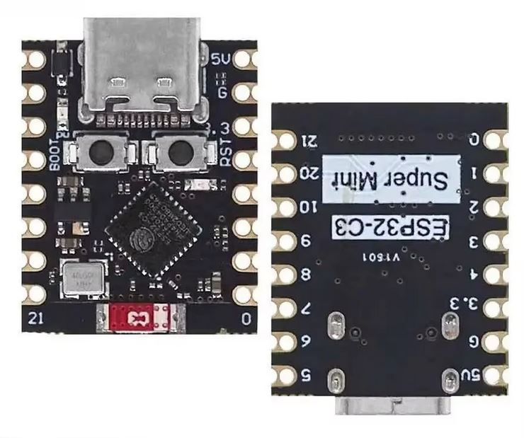

AHT10 High Precision Digital Temperature and Humidity Sensor Measurement Module I2C Communication

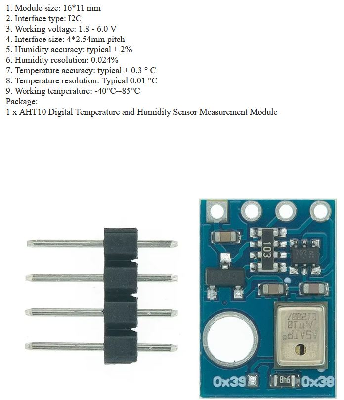

5V Low Level Trigger One 1 Channel Relay Module Interface Board Shield

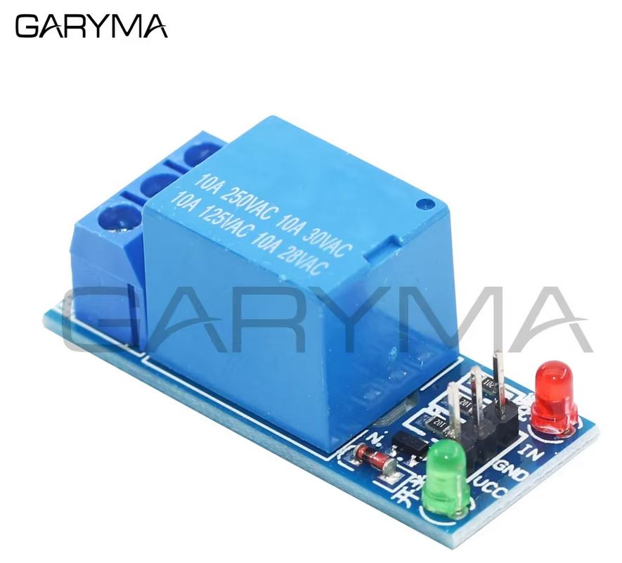

ESP32-C3 Aquarium Climate Controller

A smart aquarium thermostat based on ESP32-C3 with air temperature/humidity monitoring and heater control, featuring energy-efficient night schedule support.
🚀 Features

    Precise Thermostat: "Bang-bang" control with adjustable hysteresis.

    Emergency Protection: Automatic activation if the water temperature drops below a critical threshold.

    Night Mode: Energy savings and heating schedule compliance.

    Climate Monitoring: Air temperature and humidity measurement (AHT10).

    Hardware Reliability: Relay driver circuit using a C945 NPN transistor (logic level shifting protection).

# Attention!
It is not the status from the thermostat card that is remembered, but the parameter
name: "Aquarium Target Temp"
id: aqua_target_temp

## 🧠 Thermostat Logic

The system operates on a hierarchical principle, where automation controls the Thermostat Master Switch rather than the relay directly. This maintains overall control over the thermostat's state.
1. Emergency Mode (Priority #1)

If the water temperature falls below Target Temp - Emergency Delta, the system forces the Thermostat Master Switch to ON. This activates the aqua_climate component, which in turn switches the heater on via the relay.
2. Night Schedule (Priority #2)

This mode is managed by the "Enable Night Schedule" (schedule_mode) switch.

    If mode is ENABLED:

        The system checks the current time (via SNTP synchronization).

        Day period (06:50 – 23:10): The system turns OFF the Thermostat Master Switch.

        Night period (23:10 – 06:50): The system turns ON the Thermostat Master Switch.

    If mode is DISABLED:

        Automation does not intervene; the thermostat operates according to manual Target Temp settings.

3. Offline Mode (Fail-safe)

If Wi-Fi is unavailable or time synchronization fails, the system cannot guarantee schedule accuracy. In this case, a safety mechanism triggers:

    The system forces the Thermostat Master Switch to ON to ensure water heating and prevent aquarium overcooling.

4. Logic Diagram
Фрагмент кода

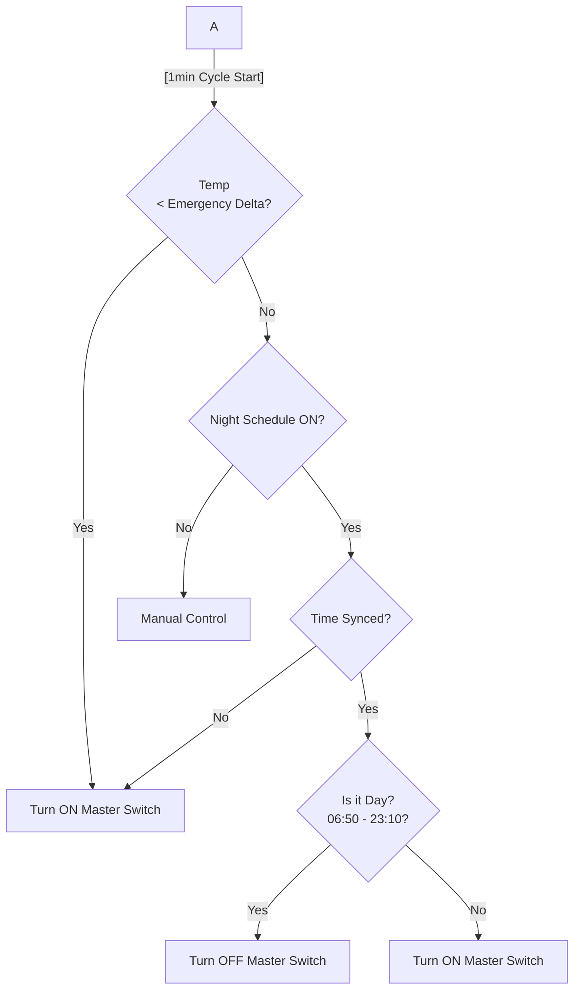

🛠 Components

    Controller: ESP32-C3 Mini.

    Water Temperature: DS18B20 (OneWire).

    Air Climate: AHT10 (I2C).

    Power Section: 5V Relay + C945 (NPN) transistor.

🔌 Wiring Diagram
Pinout Table
Component	ESP32-C3 Pin	Note
DS18B20	GPIO4	4.7k resistor required
AHT10 (SDA)	GPIO6	I2C
AHT10 (SCL)	GPIO7	I2C
Relay (via C945)	GPIO5	Control Output
Status LED	GPIO10	PWM
Relay Driver Circuit (C945)
Фрагмент кода

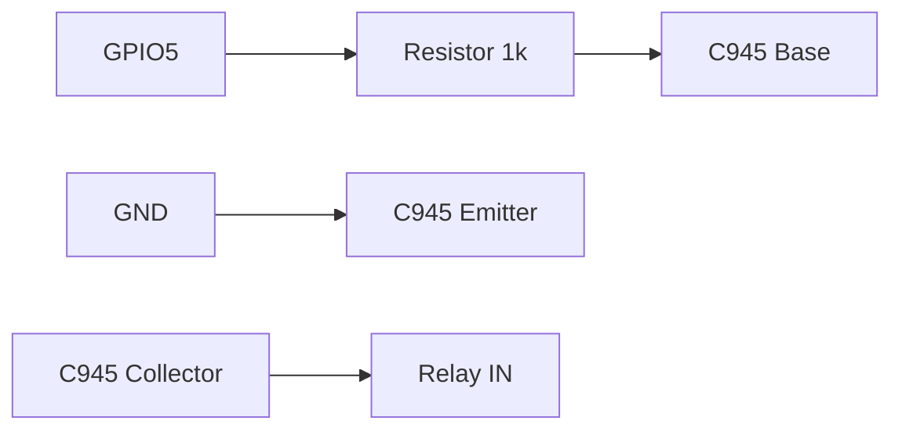

> ### ⚠️ Warning
>
>   ** Safety: This device controls a heater operating at 220V. Follow all electrical safety regulations when assembling the power section.

WEB interface:

WEB interface:

HOME ASSISTANT interface:

⚙️ Parts/Modules:
    
Development Board Modules Super Mini Development Board 32-Bit Single-Core Processor ESP32 C3 16Pin Type-C

AHT10 High Precision Digital Temperature and Humidity Sensor Measurement Module I2C Communication

5V Low Level Trigger One 1 Channel Relay Module Interface Board Shield

